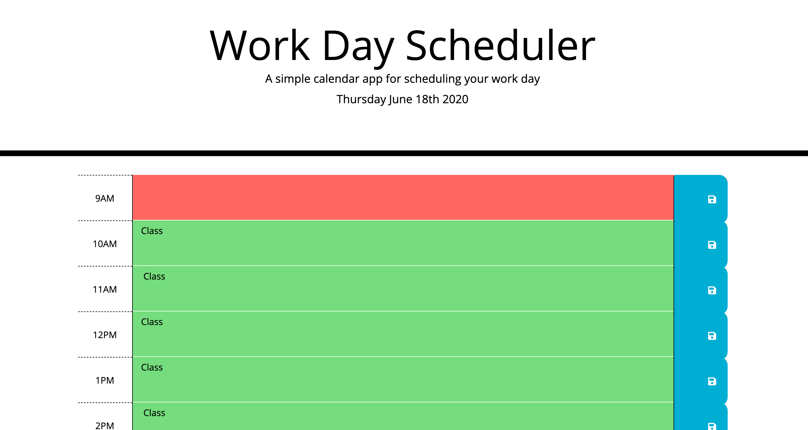

# workdayplanner

Calendar Application

## Link

https://lindyem.github.io/workdayplanner/

## Description

Project consists of a day planner calendar app made with moment.js and JQuery. Saves user input into local storage and retrieves it on refresh.

## Technology Used

- HTML5
- CSS3
- JQUERY
- moment.js

#Screenshot \*
#Screenshot \*
#Screenshot \*
#Screenshot \*
