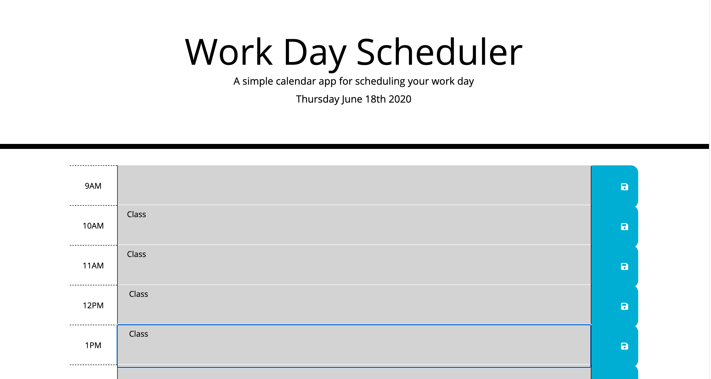
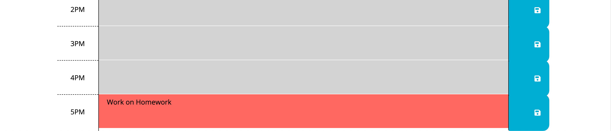
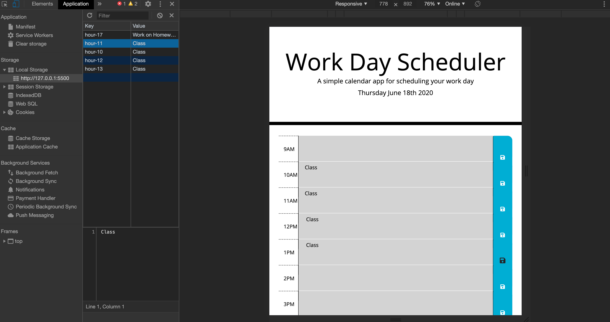

# workdayplanner
Calendar Application 

## Link

https://lindyem.github.io/codingquiz/

## Description

Project consists of a vanilla Javascript quiz game. User chooses correct answers and is awarded a highscore based on their time. If the user selects the correct answer they progress, if they select incorrectly they lose 10 seconds and do not progress.

## Technology Used

- HTML5
- CSS3
- JAVASCRIPT

#Screenshot \*
#Screenshot \*
#Screenshot \*
